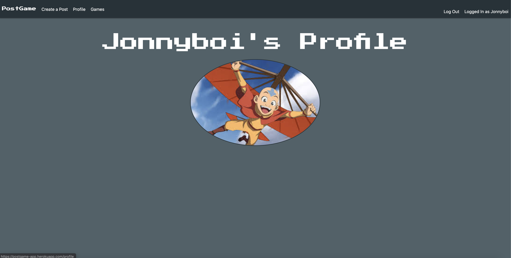

# PostGame

## Description
A social media application where you can look for people to play video games with, and to share what games you're currently playing!

## Screenshots
### Home Page

### New Post Page

### Post Detail Page

### Profile Page

### Games Page

## Technologies
- JavaScript
- HMTL
- Node
- Express
- MongoDB
- Mongoose
- React
- CSS/Materialize

## Getting Started
### Link to Trello planning board
[Link to Trello](https://trello.com/b/yxjHMj4S/postgame)

### Link to PostGame app
[Link to Heroku](https://postgame-app.herokuapp.com/)

## Future Enhancements
- Edit and have public profiles
- Add Favorite Games
- Sort Posts by newest
- Add other users as friends
- Have a filter to see posts by game
## Author
- **Fabrizio Lopez**